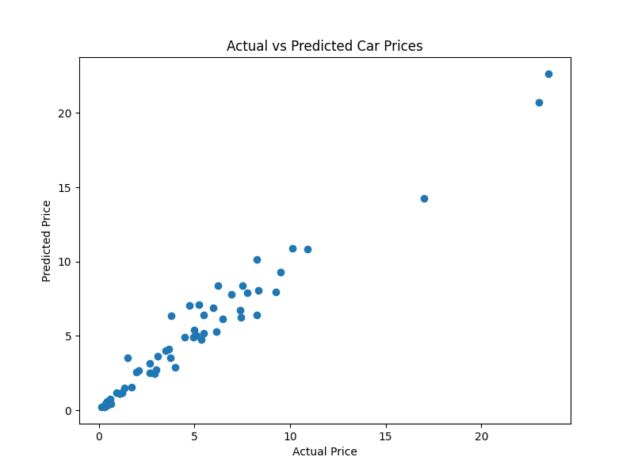
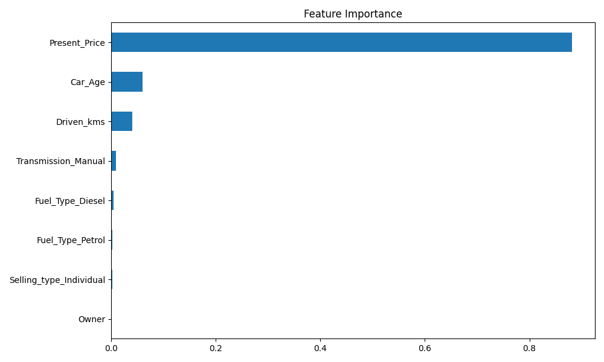

# Car Price Prediction using Machine Learning

## Project Overview

This project predicts the selling price of a car using Machine Learning techniques. Various factors such as car age, present price, fuel type, transmission type, and kilometers driven are used to estimate the selling price.

The project demonstrates a real-world application of regression models for price prediction.

---

## Objectives

* Analyze car-related features
* Perform data preprocessing and feature engineering
* Train a machine learning regression model
* Predict car selling prices
* Evaluate model performance using regression metrics

---

## Technologies Used

* Python
* Pandas
* NumPy
* Matplotlib
* Scikit-learn

---

## Dataset Features

The dataset contains:

* Car Name
* Year
* Selling Price
* Present Price
* Driven Kilometers
* Fuel Type
* Selling Type
* Transmission
* Owner

---

## Machine Learning Model

### Random Forest Regressor

Random Forest Regressor was used because it:

* Handles nonlinear relationships effectively
* Provides high prediction accuracy
* Reduces overfitting through ensemble learning

---

## Data Preprocessing

* Checked for missing values
* Created a new feature: Car Age
* Removed unnecessary columns
* Converted categorical variables using One-Hot Encoding

---

## Model Performance

| Metric   | Value  |
| -------- | ------ |
| MAE      | 0.64   |
| MSE      | 0.93   |
| R² Score | 0.9595 |

---

## Actual vs Predicted Prices



This graph compares actual car prices with the prices predicted by the model.

---

## Feature Importance



This graph shows which features have the greatest impact on car price prediction.

---

## Project Structure

CodeAlpha_CarPricePrediction/

├── car data.csv
├── car_price_prediction.py
├── README.md
├── requirements.txt
├── actual_vs_predicted.png
└── feature_importance.png

---

## Installation

```bash
pip install pandas numpy matplotlib scikit-learn
```

---

## Run Project

```bash
python car_price_prediction.py
```

---

## Results

* Successfully trained a machine learning regression model.
* Achieved an R² Score of 95.95%.
* Generated visualizations for prediction analysis and feature importance.
* Demonstrated practical application of machine learning in car price estimation.

---

## Conclusion

The Random Forest Regressor successfully predicted car prices with high accuracy. The project demonstrates how machine learning can be applied to real-world pricing problems and decision-making systems.

